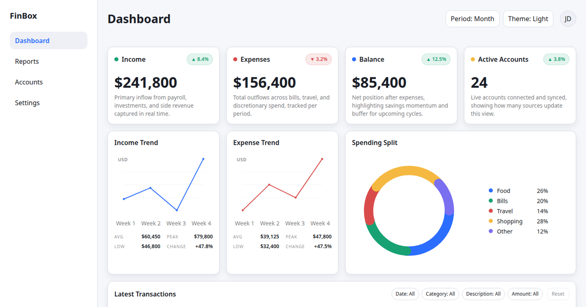

# FinBox

A financial analytics dashboard built with vanilla JavaScript, modern CSS and no runtime dependencies.

🔗 **Live demo:** https://den-dev-web.github.io/finbox/



---

## ✨ Features

- **Metrics, trends and spending split** for day / week / month / year periods
- **SVG charts drawn from scratch** — line and doughnut charts without a chart library
- **Transactions table** with sorting, per-column filters and pagination
- **Light and dark themes** — follows the OS setting, remembers the user's choice, no flash on load
- **Loading and error states** for every widget, plus an empty state for the filtered table
- **Keyboard support** — dropdowns use the listbox pattern (arrows, Home/End, Enter, Escape)
- **Reduced motion** — animations are skipped when the OS asks for it

Append `?fail=1` to the URL to see the error states.

---

## 📊 Lighthouse

Measured on the live demo, light and dark themes.

| Profile | Performance | Accessibility | Best Practices | SEO |
| :------ | :---------: | :-----------: | :------------: | :-: |
| Mobile  |     98+     |      100      |      100       | 100 |
| Desktop |     100     |      100      |      100       | 100 |

- **No layout shift (CLS 0):** skeletons reserve the final size of every widget.
- **WCAG AA contrast** in both themes: text colors are separate tokens with a verified 4.5:1 ratio.

---

## ⚙️ Tech Stack

| Area           | Tools                                                                        |
| :------------- | :--------------------------------------------------------------------------- |
| Markup & logic | HTML5, CSS, JavaScript (ES modules) — no frameworks, no runtime dependencies |
| Build          | Vite                                                                         |
| Code quality   | ESLint, Stylelint, Prettier                                                  |
| Testing        | Playwright (smoke, axe accessibility, visual regression), html-validate      |
| CI/CD          | GitHub Actions → GitHub Pages                                                |

---

## 🧩 Architecture

**CSS — ITCSS layers with namespaced BEM.** Styles go from generic to specific: `settings` (design tokens) → `generic` (reset) → `elements` → `objects` (`o-` layout) → `components` (`c-`) → `utilities` (`u-`). States use `is-` classes and `data-state` attributes. Stylelint enforces the naming.

**Design tokens.** Colors, spacing, radii, shadows and motion are CSS custom properties. The dark theme works by redefining tokens under `[data-theme="dark"]`.

**Event-driven modules.** Each widget is an independent module. A small store loads data and broadcasts `data:loaded` / `data:error` events; widgets subscribe and render. Modules never import each other.

**Mock API.** `src/js/data/api.js` simulates network latency over a static JSON file, so the UI handles real async states.

```
src/
├── js/
│   ├── data/      # mock API
│   ├── state/     # store and data events
│   └── modules/   # charts, table, metrics, dropdown, sidebar, theme, reveal
└── styles/        # ITCSS layers: settings → generic → elements → objects → components → utilities
public/data/       # mock dataset
```

---

## 🧪 Local Development

Requires Node.js 22 (see `.nvmrc`).

```bash
npm install
npm run dev        # dev server
npm run build      # production build to dist/
npm run preview    # serve the production build
npm run lint       # ESLint + Stylelint + Prettier check
npm run format     # auto-fix formatting
npm run test:e2e   # smoke, accessibility and HTML tests
npm run test:visual # screenshot comparison: 3 browsers × 3 widths × 2 themes
```

Tests run in the official Playwright container (Podman locally, GitHub Actions in CI), so screenshots are pixel-identical everywhere. Every pull request runs lint, build and all tests; a push to `main` deploys to GitHub Pages only when they pass.
